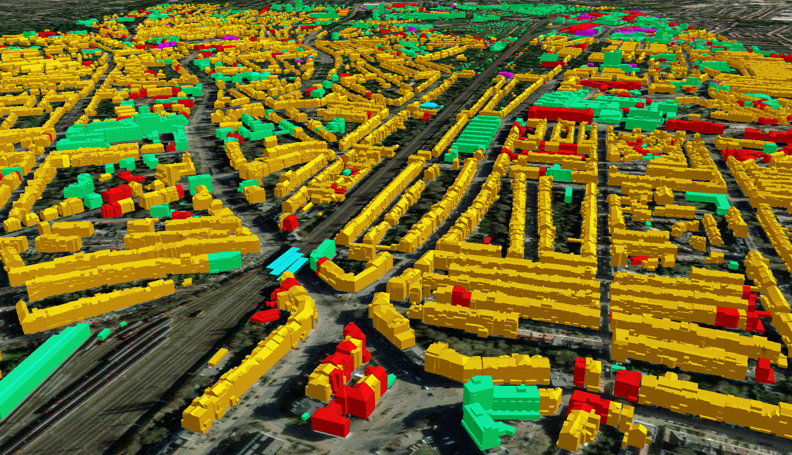
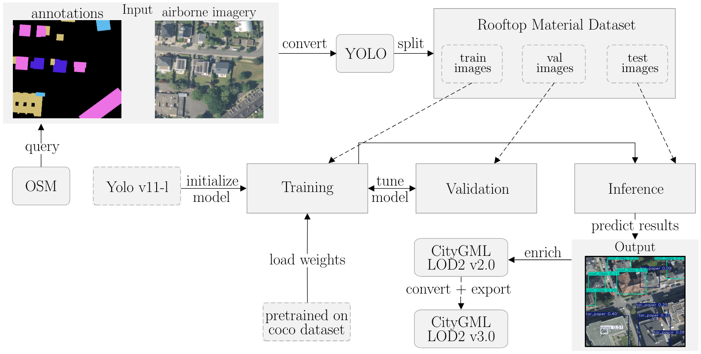

# Semantic 3D City Models with Roofing Materials

This repository contains the source code accompanying our paper:

[Object Detection for the Enrichment of Semantic 3D City Models with Roofing Materials]() </br>
[**Lukas Arzoumanidis**](https://github.com/luarzou),
[**Son H. Nguyen**](https://github.com/Son-HNguyen),
**Lara Johannsen**,
**Filip Rothaut**,
[**Weilian Li**](https://vgewilliam.github.io/),
[**Youness Dehbi**](https://www.hcu-hamburg.de/en/youness-dehbi), 

Our work presents a novel approach to enrich semantic 3D city models (CityGML datasets stored in 3DCityDB) with roof materials predicted based on OSM data and aerial imagery.



### Detecting and integrating roof materials into semantic 3D city model



To generate annotated training data containing roof material in-
formation, we utilized OSM data. To ensure coverage of all com-
monly found materials in Germany, we queried the complete
OSM dataset for the Germany using the Overpass API: 

```xml
area[name="Deutschland"]->.searchArea;
(
  way["roof:material"](area.searchArea);
  relation["roof:material"](area.searchArea);
);
out body;
>;
out skel qt;
```

To focus on the most relevant data, we filtered the material types from OSM to retain only the most frequently occurring ones (tar paper, concrete, metal, glass, and roof tiles), removing rare, ambiguous, misspelled or false entries. We construct a grid with cells of 100×100 meters, which serves to define both the spatial extent of the roof material annotations from OSM and the corresponding aerial image patches. We imposed a constraint on grid cell selection: only those cells containing at least three distinct rooftop instances, each larger than 10 square meters, were retained. After that we used the selected grid cells to extract aerial image patches at a map scale of 1:2400. Each patch was cropped to a size of 500×500 pixels, resulting in the final training pairs of aligned image data and roof material labels. To visualize the predicted results in our area of interest, we converted the object coordinates from the YOLO annotation format to real-world coordinates in the ETRS89 / UTM Zone 32N coordinate system. This conversion was performed using the coordinate bounding box provided with each aerial image that was used for inference, which is stored as a GeoTIFF. The resulting coordinates were then saved as Well Known Text (WKT) for the integration into 3D city models, such as CityGML, later on.

### Ultralytics

The model employed in our work is YOLOv11-l, as provided in the official Ultralytics repository: https://github.com/ultralytics/ultralytics.

### Docker 

The visualization of all enriched buildings highlighted by predicted roof materials can be shown using Docker:

```bash
# Pull the image
docker pull sonhng/citydb-roofmats-ai:linux-latest

# Run the image
docker run -it -p 8080:80 -p 5000:5000 sonhng/citydb-roofmats-ai:linux-latest
```

**Note**: The Docker image above applies for both AMD64-based Linux OS and ARM64-based Mac OS (Apple Silicon).
This also works for Windows OS using Docker in WSL2.

Open web client in browser:

+ Buildings highlighted by 5 different roof materials:

  http://localhost:8080/buildings_all

+ Buildings (with all colors) in Urban Heat Analysis:

  http://localhost:8080/buildings_all_lst

+ Buildings (with green potential) in Urban Heat Analysis:

  http://localhost:8080/buildings_green_lst


## Cite

<pre><code>@misc{arzoumanidis2025roofmatscitydb,
      title={Object Detection for the Enrichment of Semantic 3D City Models with Roofing Materials},
      author={Arzoumanidis, Lukas and Nguyen, Son H. and Johannsen, Lara and Rothaut, Filip and Li, Weilian and Dehbi, Youness},
      year={2025},
      journal = {ISPRS Ann. Photogramm. Remote Sens. Spatial Inf. Sci.},
      volume = {},
      pages = {},
      doi = {}
}</code></pre>

## Troubleshooting

In case the code is not working for you or you experience some code related problems, please consider opening an issue.